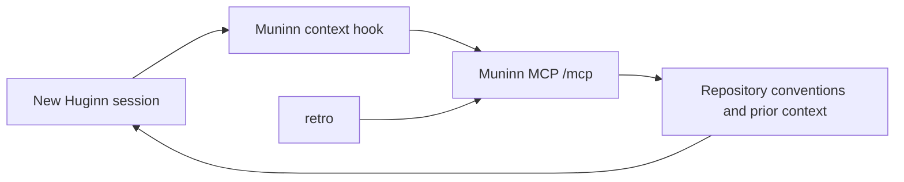

# Muninn MCP Cutover Design

## Goal

Make Muninn, configured by the untracked `MUNINN_MCP_URL`, Huginn’s sole operational knowledge store. New sessions must retrieve repository conventions and prior session context from Muninn. OMP must not read from or write to `~/vault`.

Existing vault files remain untouched as historical data. They are not a fallback source.

## Scope

The cutover covers every current vault surface in both the tracked `.omp/agent/` configuration and the live `~/.omp/agent/` copy:

1. `AGENTS.md` imports of vault identity, rules, conventions, and Lucas context.
2. `hooks/vault.ts`, which creates local session stubs and injects stack conventions plus the five newest project notes. It is replaced by a Muninn-backed context hook.
3. The `retro` skill, which appends session notes to `~/vault/projects/...`.

It does not migrate existing local vault files, replace OMP’s built-in local memory backend, or alter repository-specific `AGENTS.md` files.

## Architecture

### MCP transport

`mcp.json` registers a `muninn` HTTP server using the exact `/mcp` endpoint. The existing Vercel MCP entry remains unchanged. No local mirror, cache, or vault fallback is introduced.

Muninn already exposes the MCP tools required for this cutover:

- **`vault_read`** reads a vault-relative filename, including `tech/...` and `projects/...` paths.
- **`vault_list`** lists vault-relative paths for a glob pattern. The context hook sorts a project’s result and selects its latest five session files.
- **`vault_write`** creates or replaces a vault-relative file. `retro` first reads the daily note when present, appends its structured entry locally in memory, then writes the complete updated note through this tool.

`vault_search` remains available for agent-directed research but is not part of deterministic session injection. No Muninn server change is required.

### Session behavior

The local global `AGENTS.md` remains as a compact, non-duplicated bootstrap policy: identity, safety, and deployment approval. It identifies Muninn as authoritative but does not duplicate its mutable content.

`hooks/muninn.ts` replaces `hooks/vault.ts`. On every session-context event it derives the existing repository identity, calls `vault_read` for the four former `AGENTS.md` imports (`tech/huginn-identity.md`, `tech/huginn-web-rules.md`, `tech/huginn-conventions.md`, and `life/010-Lucas.md`), universal and stack-specific conventions, calls `vault_list` for the project branch, reads the five latest returned session files with `vault_read`, and injects the assembled text into the new session before the model responds. It creates no local stub and persists no local context.

This preserves today’s automatic session-start context behavior: a new Huginn session receives applicable conventions and prior project context without relying on the model to remember an on-demand lookup. `hooks/vault.ts` is removed.

If Muninn cannot provide required context, the hook injects a clear unavailable-context notice. Huginn must not silently read from `~/vault`.

### Retrospectives

`retro` remains available but becomes a Muninn client instruction rather than a vault writer. It uses `vault_read` and `vault_write` to append the existing concise structured retrospective to the daily project note. A subsequent fresh session for the same repository and branch must receive it through the automatic `vault_list` and `vault_read` context injection.

## Data Flow

The local OMP configuration contains endpoint configuration, the bridge, and invariant operating policy. Muninn contains mutable knowledge and project history.

## Failure Handling

- Invalid or unavailable MCP transport: inject an unavailable-context notice; do not consult local vault files.
- Missing or incompatible `vault_read`, `vault_list`, or `vault_write` operation: report the unavailable Muninn contract; do not ship a partial cutover.
- Missing project metadata: use the existing repository identity convention where available; otherwise inject a request for the minimum identity needed for the lookup.
- Failed retrospective write: report the failure and do not claim a session note was recorded.

## Verification

1. Verify `tools/list` against the configured `muninn` MCP server and exercise `vault_read` for `tech/030-Coding-Style.md` plus `vault_list` for this repository and branch.
2. Start a fresh Huginn session and verify the hook injects identity, web rules, Huginn conventions, Lucas context, expected repository conventions, and five newest prior session notes before the model’s first substantive response.
3. Run `retro`, then verify a separate fresh session receives that newly written summary through automatic `vault_list` and `vault_read` context injection.
4. Verify the tracked and live agent configurations contain no active `~/vault` import, file read, stub creation, or retrospective write path; verify `hooks/muninn.ts` is active instead.
5. Verify the existing Vercel MCP server remains configured and available.
